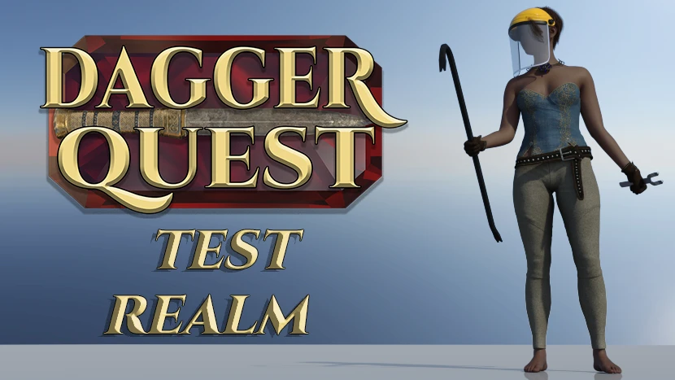

### The official testing environment for *DaggerQuest*.

## 🔬 Test New Releases

**Access the Test Realm at: [Test.DaggerQuest.com](https://Test.DaggerQuest.com/)**

## 🛠️ Development Workflow

There can only be one GitHub Pages site per repository, so this repository was made to host the Test Realm.

The website is stripped down and all the links point to their equivalent pages on [DaggerQuest.com](https://DaggerQuest.com/).

The Test Realm may be updated and/or wiped without warning.

### 📋 Related Repositories

- [**DaggerQuest**](https://github.com/Vineyard-Technologies/DaggerQuest) - The main repository for the *DaggerQuest* codebase.
- [**DaggerQuest.com**](https://github.com/Vineyard-Technologies/DaggerQuest.com) - The website where you can play *DaggerQuest*, read news posts, and browse the guide.
- [**DaggerTest**](https://github.com/Vineyard-Technologies/DaggerTest) - A testing framework for *DaggerQuest* and [DaggerQuest.com](https://DaggerQuest.com).
- [**Overlord**](https://github.com/Vineyard-Technologies/Overlord) - An render pipeline management tool used to generated assets for *DaggerQuest*.
- [**CAFfeine**](https://github.com/Vineyard-Technologies/CAFfeine) - An automation and testing framework for *DaggerQuest* and Construct 3 in general.

## ✒️ License

This project is licensed under the [AGPL 3.0 License](https://www.gnu.org/licenses/agpl-3.0.html.en) - see the [LICENSE](LICENSE) file for details.
